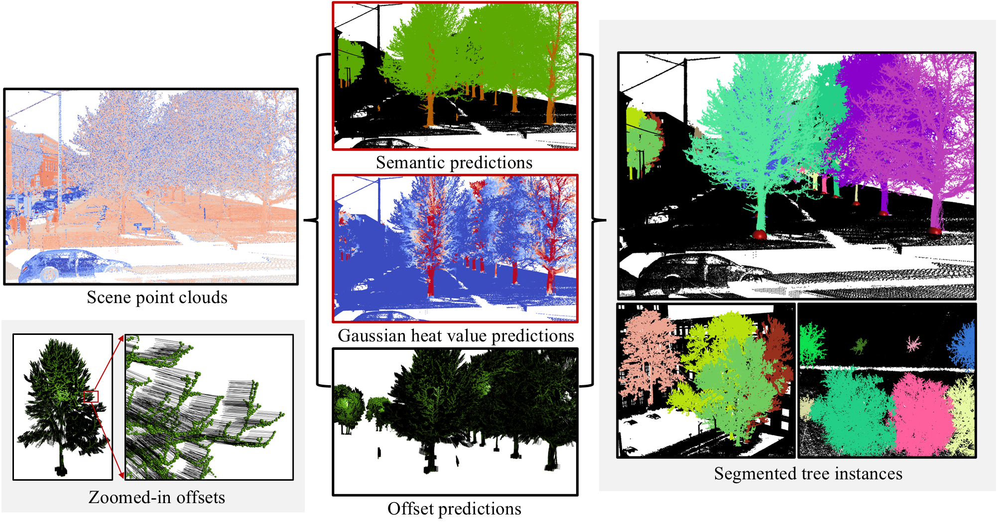

# SATree: Structure-aware tree instance segmentation from 3D LiDAR point clouds

This repo is the implementation for [SATree: Structure-aware tree instance segmentation from 3D LiDAR point clouds](https://authors.elsevier.com/sd/article/S1618-8667(26)00154-8).



## Overview
We propose SATree, a novel structure-aware approach that directly identifies important tree structures, such as crowns and stems, from point clouds, enabling robust tree instance segmentation against tree overlaps and varying tree sizes. Our method leverages a multi-task learning framework that simultaneously performs (i) semantic segmentation to classify a point as crown, stem, or other; (ii) heatmap prediction to assign a heat value to each point based on 2D Gaussian kernels centered at tree stem locations; (iii) offset prediction to estimate point-wise offset vectors pointing to the instance centroid. Our research outputs are precisely segmented 3D tree instances that support downstream forestry inventory, 3D tree reconstruction, and fine-grained part segmentation of trees. 

## Instructions for data preprocessing
### TreeML
For TreeML dataset, the original data can be downloaded from [this](https://springernature.figshare.com/collections/TreeML-Data_a_multidisciplinary_and_multilayer_urban_tree_dataset/6788358/1) link. We need three datasets:
- Dataset_tree
- Dataset_building_other
- Dataset_QSM

cd to `SATree/SANet/openpoints/dataset/treeml/prepare_treeml_strongstem.py`, specify the paths for these three datasets in L274-L276. Besides, you need to specify your own output ply path. Then, you can run preprocessing using:

        python prepare_treeml_strongstem.py

### ForInstance
For ForInstance dataset, the original data can be downloaded from [this](https://zenodo.org/records/8287792) link. Download the whole dataset without changing the folder structure. cd to `SATree/SANet/openpoints/dataset/forinstance/prepare_forinstance.py`, specify the tree path and output ply path in L171 and L175. Then, you can run preprocessing using:

        python prepare_forinstance.py

Note that the following packages are required to successfully run preprocessing scripts:
- pandas
- scikit-learn
- h5py
- laspy

## SANet Training procedures
### Backbone
We adopt [PointMetaBase](https://arxiv.org/abs/2211.14462) as the backbone for point feature learning. Please refer to their [Pytorch implementation](https://github.com/linhaojia13/PointMetaBase) for installation and setup.

### Training SANet on TreeML
cd to `SATree/SANet/cfgs/treeml/default.yaml`, specify the ply path of the previously processed data in the field `data_root`. Then, you can train SANet on TreeML using:

        CUDA_VISIBLE_DEVICES=0 bash script/main_segmentation.sh cfgs/treeml/pointmetabase-l.yaml wandb.use_wandb=False

For testing, you can use:

        CUDA_VISIBLE_DEVICES=0 bash script/main_segmentation.sh cfgs/treeml/pointmetabase-l.yaml wandb.use_wandb=False mode=test --pretrained_path [specify your pretrained weight here. By default, we use the ckpt_latest.pth for testing]


### Training SANet on ForInstance
It is performed in a manner analogous to TreeML training.

## Running SASeg
Coming soon...

## Evaluation
Coming soon...

## Citation
If you use (part of) the code/approach in a scientific work, please cite our paper:
```
@article{du2026satree,
  title={SATree: Structure-aware tree instance segmentation from 3D LiDAR point clouds},
  author={Du, Shenglan and Stoter, Jantien and Kooij, Julian F.P. and Nan, Liangliang},
  journal={Urban Forestry &amp; Urban Greening},
  year={2026},
  doi={10.1016/j.ufug.2026.129414}
}
```

